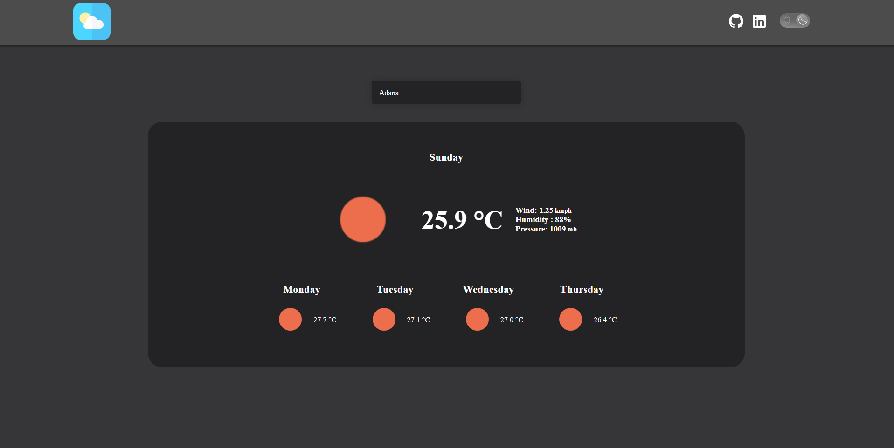

### Ödev

## Türkiye hava durumu uygulaması geliştirmeniz gerekiyor.
-----

### Gereksinimler
- Hava raporunda görüntülenen veriler tamamen gerçeği yansıtmalıdır. Hava durum bilgilerine erişmek için OpenWeather API kullanılabilir. Veya dilediğiniz farklı bir API'ı da kullanabilirsiniz.
- Hava raporu, içinde bulunduğumuz günden başlayarak önümüzdeki bir haftalık süreci yansıtmalıdır.
- Sayfa ilk açıldığında varsayılan olarak dilediğiniz herhangi şehrin hava durumunu gösterebilirsiniz veya kullanıcıdan konum erişim izni isteyerek web sayfasını kullanan kişinin bulunduğu şehrin raporunu gösterebilirsiniz.
- Günlerin listelendiği kartlarda gün adı, hava durumu görseli(güneşli, yağmurlu, karlı, parçalı bulutlu) ve sıcaklık bilgisi gösterilmelidir.
- Bir dropdown aracılığı ile farklı bir şehrin hava raporuna ulaşılabilmelidir.
Tasarımı dilediğiniz gibi yapabilirsiniz.
-----

Demo için [tıklayın]().

---
#### - REDUX
#### - ThunkMiddleware
#### - REACT
#### - CSS
#### - OpenWeather API

-----------

##### Proje Ekran Görüntüsü

